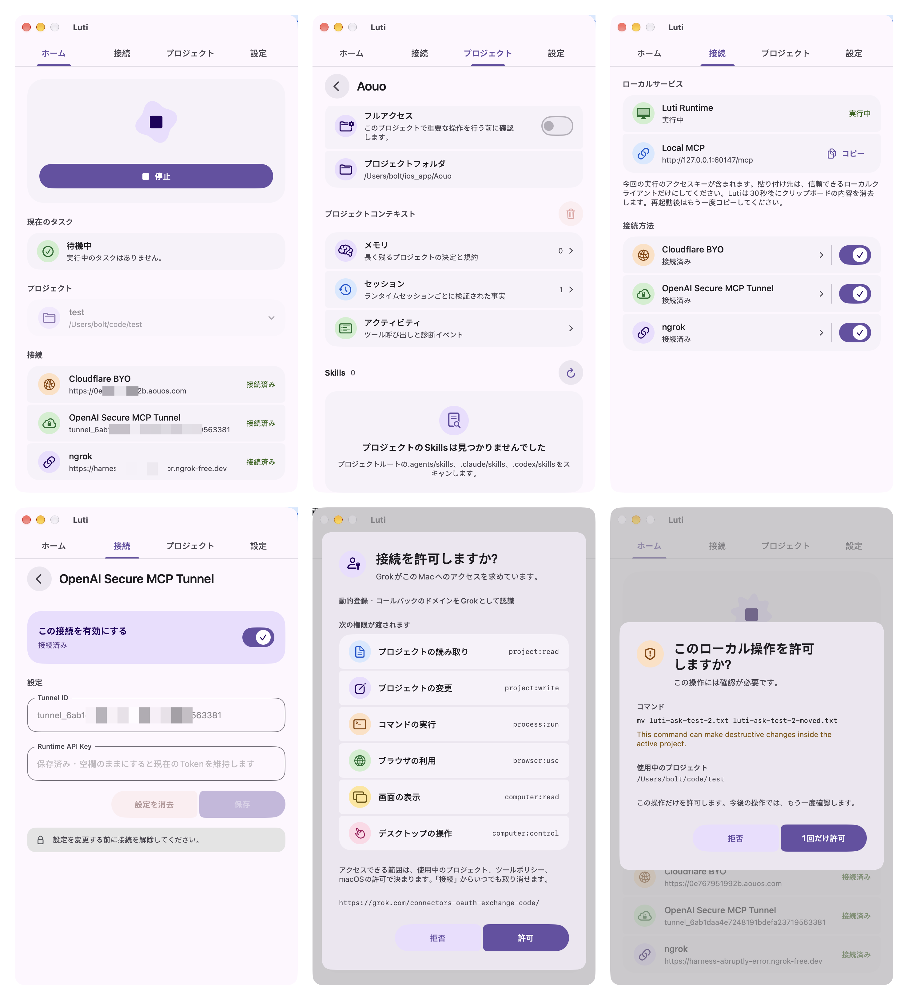
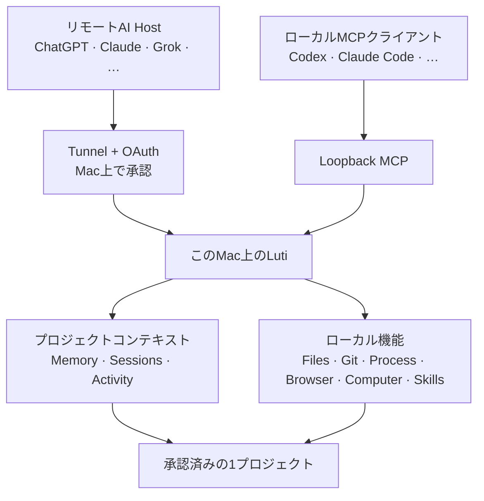

<div align="center">


# Luti

**AIのためのローカルプロジェクトランタイム。**

MCP対応のAIを、Mac上で承認したプロジェクトに接続します。ローカルツール、共有できるプロジェクトコンテキスト、明確な権限境界をLutiがまとめて管理します。

[](LICENSE) [](#動作要件) [](#ソースからビルド)

[English](README.md) · [简体中文](README.zh-CN.md) · 日本語

[Website](https://luti.aouos.com/) · [Download](https://github.com/boltguo/Luti/releases/latest/download/Luti.dmg) · [GitHub](https://github.com/boltguo/Luti) · [Support](https://buymeacoffee.com/boltguo)

</div>

<p align="center">
  
</p>

## Lutiでできること

Lutiは、AIクライアントを承認済みのひとつのプロジェクトにつなぎます。推論とオーケストレーションはAI Hostが担い、ツールのローカル実行、プロジェクト境界、権限、復元はLutiが管理します。



ファイルの読み書き、ビルドやテスト、Gitの確認、ブラウザやデスクトップの操作、成果物の書き出しに対応します。プロジェクトの知識は、異なるAIクライアント間でも共有できます。これらの操作はすべてMac上で実行されます。

## クイックスタート

1. **Lutiをインストール。** 最新のGitHub Releaseから署名済みのDMGを入手するか、ソースからビルドします。
2. **プロジェクトを追加。** **Projects**でフォルダを選び、Permission Modeを設定して有効にします。
3. **接続を有効化。** 必要なリモートProviderを設定します。同じMac上のクライアントなら**Local MCP**を利用できます。
4. **AIを接続。** LutiをMCP Serverとして追加します。Public OAuth ClientはDCR + PKCEで登録したあと、このMac上での承認を待ちます。

リモートHostが切り替えられるのは、Lutiで有効にしたプロジェクトだけです。複数の接続を同時に動かし、同じアクティブプロジェクトとコンテキストを共有できます。

## 接続方式

| 接続 | 用意するもの | 認証 | 向いている用途 |
|---|---|---|---|
| **Local MCP** | 追加設定なし | RuntimeごとのLoopback Bearer | 同じMac上のAIクライアント |
| **Cloudflare BYO** | HTTPS Origin + Cloudflare Tunnel Token | Luti OAuth + Mac上の承認 | 自分の安定したCloudflare Endpoint |
| **OpenAI Secure MCP Tunnel** | Tunnel ID + Runtime API Key | 専用のDelegated Credential | OpenAI Secure Tunnel経路 |
| **ngrok** | HTTPS Domain + Authtoken | Luti OAuth + Mac上の承認 | 安定したngrok Endpoint |

Cloudflareとngrokでは、設定後に完全な`/mcp` URLが表示され、そのままコピーできます。Public Originを変更すると、古いOriginに結びついた認可は無効になります。OpenAI Secure MCP Tunnelは専用のIngress Credentialを使います。

各Providerは、それぞれ独立したListenerで動作します。ひとつのProviderに問題が起きても、ほかの接続、ローカルRuntime、実行中のJobは停止しません。

## 機能

Lutiは8領域・**29個のPublic MCP Tool**を公開します。

| Domain | Public Tools | 範囲 |
|---|---|---|
| Context | `memory` | Recall、Remember、Session参照、Forget |
| Project | `projects`, `project_info`, `inspect_project`, `runtime_status` | 承認済みProject、切り替え、Discovery、Runtime状態 |
| Files & Code | `list_directory`, `read_files`, `read_image`, `search_project`, `edit_files`, `path_action`, `code_query` | 検索、読み取り、編集、移動、構造化コード照会 |
| Process & Jobs | `run_process`, `run_shell`, `job_query`, `job_action` | Build、Test、長時間Job、Log、PTY入力、停止 |
| Git | `git_query` | Status、Diff、Log、Show、Blame。読み取り専用 |
| Browser | `browser_session`, `browser_observe`, `browser_action`, `browser_transfer`, `browser_inspect`, `browser_dialog`, `browser_evaluate` | Navigation、Action、Screenshot、Transfer、Console、Network、Dialog |
| Computer | `computer_observe`, `computer_action`, `computer_wait` | macOSの観察、入力、状態待ち |
| Skills & Artifacts | `skills`, `export_artifact` | Project Skillと不変Artifact |

プロジェクト固有の動作は、そのプロジェクトのmanifest、instructions、tasks、skillsで定義します。Public Toolを増やす必要はありません。

## コンテキストと復元

| Layer | 役割 |
|---|---|
| **Memory** | 長期的な決定、規約、制約、設計、落とし穴 |
| **Sessions** | ひとつのRuntime Sessionにおける変更、実行、検証結果の要点 |
| **Activity** | 認証済みの呼び出し元を含むTool実行履歴 |

各MemoryはRevision管理されます。プロジェクトごとに保持できる有効なMemoryは最大200件、追記型Ledgerは最大8 MiBです。どちらかの上限に達すると、既存の記憶を黙って削除せず、新規書き込みを拒否します。

ファイルやパスを変更する前に、Lutiはサイズと件数に上限のあるPrivate Checkpointを作成します。Project Contextと復元データは`~/.luti/`に保存され、RepositoryへRuntime Metadataを書き込みません。

## セキュリティとプライバシー

| 境界 | 動作 |
|---|---|
| **Project Scope** | ファイルとProject操作を現在の承認済みProjectに限定 |
| **Permission Mode** | `Ask`は機密操作にMac上の承認を要求し、`Full Project Access`は同じProject内の確認を減らす |
| **Credential** | Runtime CredentialをmacOS Keychainに保存し、機密値を永続化前にRedact |
| **OAuth** | Public ClientはOriginに結びつき、このMac上の承認が必要 |
| **Git** | 公開Git Capabilityは読み取り専用 |
| **Browser / Computer Use** | Lutiが所有するBrowser Sessionだけを操作し、画面収録とAccessibilityは独立したmacOS権限として扱う |
| **Process Execution** | `fullLocal`はユーザー権限で実行され、OS Sandboxではない |
| **Sandbox Profile** | OS-enforced Backendがなければ`workspace`と`isolated`はfail closed |

AIアプリのアクセスをオフにすると、既存のOAuth Grantは一時停止します。再度オンにすれば、期限内のGrantをそのまま再開できます。**取り消す**と**クライアントを削除**は、アクセスを完全に無効化します。

Lutiには、プロジェクトデータを受け取るCloud Backendがありません。ただし、接続したAI Hostには要求したTool Resultが送られ、Source Code、Command Output、Screenshotなどが含まれる場合があります。有効にするAI HostとTunnel Providerは、いずれも信頼境界の一部です。

## 動作要件

- macOS 14以降。
- Core AppはApple SiliconとIntel Macで動作。
- 現在固定しているBrowser RuntimeはApple Siliconのみで、別途Google Chromeが必要。
- ソースビルドにはXcode 26+を推奨。
- 有効にする各Remote ProviderのAccountと設定。

アプリは英語、簡体字中国語、日本語に対応しています。

## ソースからビルド

```bash
git clone https://github.com/boltguo/Luti.git
cd Luti
open Luti.xcodeproj
```

主なSchemeは`Luti`と`LutiProcessHost`です。Local Debug Buildは**Sign to Run Locally**を使います。Production ReleaseはHardened Runtimeを有効にし、署名・公証済みDMGとして配布します。Sparkleは署名済みUpdateを確認しますが、自動ではインストールしません。

## オープンソース

Lutiは[Apache License 2.0](LICENSE)で公開しています。Third-party DependencyとBundled RuntimeのLicense Noticeは[THIRD_PARTY_NOTICES](THIRD_PARTY_NOTICES)にまとめています。

変更を提案する前に[CONTRIBUTING.md](CONTRIBUTING.md)を確認してください。脆弱性は[SECURITY.md](SECURITY.md)に従って非公開で報告してください。

Lutiが役に立ったら、[Buy Me a Coffee](https://buymeacoffee.com/boltguo)から開発を支援できます。
