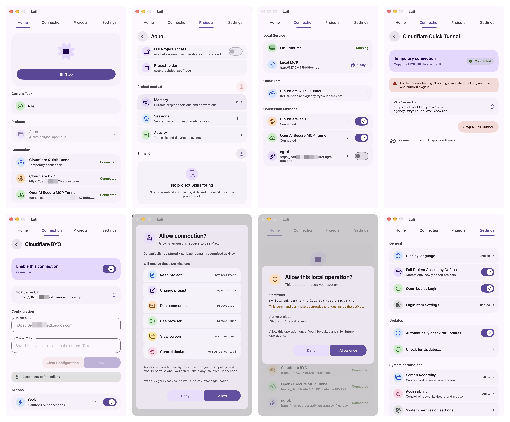

<div align="center">


# Luti

**A local project runtime for AI.**

Let MCP-compatible AI clients work inside a project you approve on your Mac. Luti provides local tools, shared project context, and clear permission boundaries.

[](LICENSE) [](#requirements) [](#build-from-source)

English · [简体中文](README.zh-CN.md) · [日本語](README.ja.md)

[Website](https://luti.aouos.com/) · [Download](https://github.com/boltguo/Luti/releases/latest/download/Luti.dmg) · [GitHub](https://github.com/boltguo/Luti) · [Support](https://buymeacoffee.com/boltguo)

</div>

<p align="center">
  
</p>

## What Luti does

Luti connects an AI client to one approved project. The AI host handles reasoning and orchestration. Luti runs tools locally and enforces the project boundary, permissions, and recovery.

```mermaid
flowchart TB
    remote["Remote AI hosts<br/>ChatGPT · Claude · Grok · …"]
    local["Local MCP clients<br/>Codex · Claude Code · …"]
    tunnel["Tunnel + OAuth<br/>Mac approval"]
    loopback["Loopback MCP"]
    luti["Luti on your Mac"]
    context["Project context<br/>Memory · Sessions · Activity"]
    tools["Local capabilities<br/>Files · Git · Process · Browser · Computer · Skills"]
    project["One approved project"]

    remote --> tunnel --> luti
    local --> loopback --> luti
    luti --> context --> project
    luti --> tools --> project
```



It can read and edit files, run builds and tests, inspect Git, drive a browser, interact with the desktop, export artifacts, and retain project knowledge across AI clients. All of these operations run on your Mac.

## Get started

1. **Install Luti.** Download the signed DMG from the latest GitHub Release, or build it from source.
2. **Add a project.** Choose a folder in **Projects**, select its permission mode, and enable it.
3. **Enable connections.** Configure any remote providers you need, or use **Local MCP** for clients on the same Mac.
4. **Connect your AI.** Add Luti as an MCP server. Public OAuth clients use DCR + PKCE, then wait for approval on this Mac.

A remote host can switch only between projects already enabled in Luti. Enabled providers run in parallel and share the same active project and project context.

## Connections

For a zero-configuration test, **Quick Tunnel** creates a temporary `trycloudflare.com` MCP endpoint from the Connections page. No Cloudflare account, domain, or token is required. The address remains available while that Quick Tunnel is running and can change when the tunnel is recreated, so clients may need to connect and authorize again. Quick Tunnel is intended for testing and has no uptime guarantee.

| Connection | What you provide | Authentication | Best for |
|---|---|---|---|
| **Local MCP** | No extra configuration | Per-runtime loopback bearer | AI clients on the same Mac |
| **Cloudflare BYO** | HTTPS origin + Cloudflare Tunnel token | Luti OAuth + Mac approval | Your own stable Cloudflare endpoint |
| **OpenAI Secure MCP Tunnel** | Tunnel ID + runtime API key | Dedicated delegated credential | OpenAI's secure tunnel path |
| **ngrok** | HTTPS domain + Authtoken | Luti OAuth + Mac approval | A stable ngrok endpoint |

Once configured, Cloudflare and ngrok display the full `/mcp` URL for direct copying. Changing the public origin invalidates authorizations tied to the old origin. OpenAI Secure MCP Tunnel uses its own ingress credential.

Providers use separate listeners, so a failure in one does not stop the other connections, local runtime, or running jobs.

## Capabilities

Luti exposes **30 public MCP tools** across eight domains.

| Domain | Public tools | Scope |
|---|---|---|
| Context | `memory` | Recall, remember, inspect sessions, forget |
| Project | `projects`, `project_info`, `inspect_project`, `runtime_status` | Approved projects, switching, discovery, runtime state |
| Files & Code | `list_directory`, `read_files`, `read_image`, `search_project`, `edit_files`, `path_action`, `code_query` | Search, read, edit, move, structured code queries |
| Process & Jobs | `run_process`, `run_shell`, `job_query`, `job_action` | Builds, tests, long jobs, logs, PTY input, stop |
| Git | `git_query` | Status, diff, log, show, blame; read-only |
| Browser | `browser_session`, `browser_observe`, `browser_action`, `browser_transfer`, `browser_inspect`, `browser_dialog`, `browser_evaluate` | Navigation, actions, screenshots, transfers, console, network, dialogs |
| Computer | `computer_observe`, `computer_action`, `computer_wait` | macOS observation, input, state waiting |
| Skills & Artifacts | `skills`, `export_artifact`, `import_artifact` | Project skills, immutable exports and controlled imports |

Project-specific behavior comes from the project's own manifest, instructions, tasks, and skills rather than an expanding public tool set.

Start with `memory(action=recent)` for a bounded resume summary and `projectToken`. Project writes, command execution, browser mutations, project switching and Job input require this token. It changes after switching projects or restarting the Runtime; re-observe the intended project after a mismatch. Stopping an owned Job remains available without a current token. Connections without project-read permission can use `projects(action=current)` to obtain only the minimal binding.

Resource listing, reads and imports check the permission for the source: project files, process logs, browser artifacts or desktop screenshots. Browser uploads also require project-read permission. `code_query` starts an installed language server, so it requires project-read and process-run permissions plus the current `projectToken`; the server may have side effects.

Job results separate process completion from recognized test results and record a bounded set of observed input files. `reportPath` can name a JUnit XML report produced by the command. Unchanged reports, incomplete output and unproven input consistency remain unknown; changed inputs are marked stale. These observations do not prove the entire project is correct.

`import_artifact` saves an unexpired artifact from the current project runtime to a new project file, up to 32 MiB, with a recovery checkpoint. It does not overwrite, execute or unpack files. Chat attachments are outside the current scope; evaluate a Host adapter only when a concrete Host exposes a verified file binding.

## Context and recovery

| Layer | Purpose |
|---|---|
| **Memory** | Long-lived decisions, conventions, constraints, architecture, and pitfalls |
| **Sessions** | Bounded facts about what a runtime session changed, ran, and verified |
| **Activity** | Tool execution history with authenticated source metadata |

Memory entries are revisioned. Each project keeps up to 200 active memories, and its append-only memory ledger is capped at 8 MiB. When either limit is reached, Luti rejects new writes rather than silently removing durable facts.

Before editing a file or changing a path, Luti creates a bounded private checkpoint. Project context and recovery data stay under `~/.luti/`; Luti does not add runtime metadata to the repository.

## Security and privacy

| Boundary | Behavior |
|---|---|
| **Project scope** | File and project operations stay inside the active approved project |
| **Permission mode** | `Ask` requests Mac approval for sensitive operations; `Full Project Access` reduces prompts within the same project |
| **Secrets** | Runtime credentials use macOS Keychain; sensitive values are redacted before persistence |
| **OAuth** | Public clients are origin-bound and require approval on this Mac |
| **Git** | Public Git capability is read-only |
| **Browser & Computer Use** | Luti owns its browser sessions; Screen Recording and Accessibility remain separate macOS permissions |
| **Process execution** | `fullLocal` runs with your user privileges and is not an OS sandbox |
| **Sandbox profiles** | `workspace` and `isolated` fail closed when an OS-enforced backend is unavailable |

Turning off access for an AI app pauses its existing OAuth grants. Turning access back on resumes grants that have not expired. **Revoke** and **Delete client** invalidate access permanently.

Luti has no cloud backend that receives project data. The AI hosts you connect still receive the tool results you request, which may include source code, command output, screenshots, or other project data. Every AI host and tunnel provider you enable is part of your trust boundary.

## Requirements

- macOS 14 or later.
- The core app runs on Apple Silicon and Intel.
- Apple Silicon and a separately installed Google Chrome for browser automation with the pinned browser runtime.
- Xcode 26+ recommended for source builds.
- An account and configuration for each remote provider you enable.

The app includes English, Simplified Chinese, and Japanese.

## Build from source

```bash
git clone https://github.com/boltguo/Luti.git
cd Luti
open Luti.xcodeproj
```

The main schemes are `Luti` and `LutiProcessHost`. Local Debug builds use **Sign to Run Locally**. Production releases keep Hardened Runtime enabled and ship as signed, notarized DMGs. Sparkle checks for signed updates but does not install them silently.

## Open source

Luti is licensed under the [Apache License 2.0](LICENSE). Third-party and bundled runtime notices are listed in [THIRD_PARTY_NOTICES](THIRD_PARTY_NOTICES).

Read [CONTRIBUTING.md](CONTRIBUTING.md) before proposing a change. Follow [SECURITY.md](SECURITY.md) to report a vulnerability privately.

If Luti is useful to you, you can support development on [Buy Me a Coffee](https://buymeacoffee.com/boltguo).
