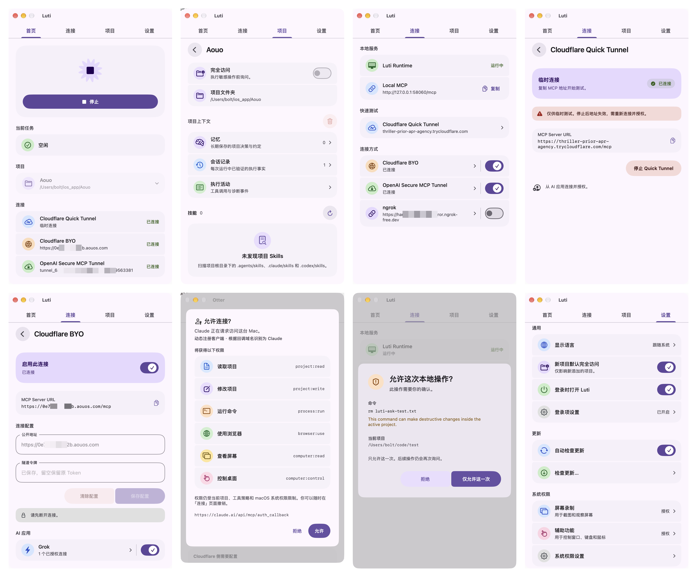
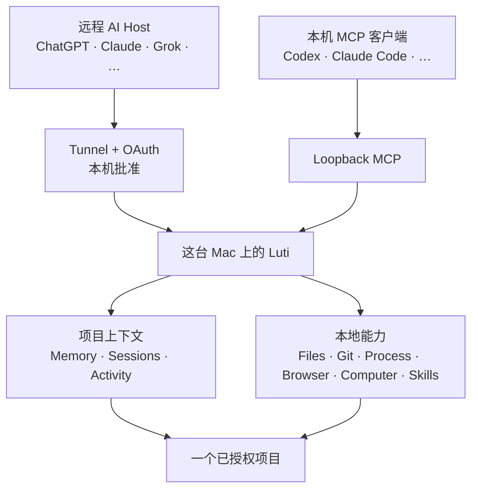

<div align="center">


# Luti

**一个给 AI 用的本地项目运行时。**

让支持 MCP 的 AI 在你授权的项目中工作。Luti 提供 Mac 本地工具、共享的项目上下文和清晰的权限边界。

[](LICENSE) [](#系统要求) [](#从源码构建)

[English](README.md) · 简体中文 · [日本語](README.ja.md)

[官网](https://luti.aouos.com/) · [下载](https://github.com/boltguo/Luti/releases/latest/download/Luti.dmg) · [GitHub](https://github.com/boltguo/Luti) · [支持开发](https://buymeacoffee.com/boltguo)

</div>

<p align="center">
  
</p>

## Luti 能做什么

Luti 把 AI 客户端连接到一个已授权项目。AI Host 负责推理和编排；Luti 在本机运行工具，并管理项目边界、权限与恢复。



它可以读写文件、运行构建和测试、查看 Git、操作浏览器与桌面、导出产物，并让不同 AI 客户端共享项目知识。这些操作都在你的 Mac 上完成。

## 快速开始

1. **安装 Luti。** 从最新 GitHub Release 下载已签名的 DMG，或从源码构建。
2. **添加项目。** 在 **Projects** 中选择文件夹、设置权限模式并启用。
3. **启用连接。** 按需配置远程 Provider；同一台 Mac 上的客户端可直接使用 **Local MCP**。
4. **连接 AI。** 把 Luti 添加为 MCP Server。公开 OAuth Client 使用 DCR + PKCE 注册，随后等待这台 Mac 批准。

远程 Host 只能切换到 Luti 中已启用的项目。多个连接可以同时运行，共享当前项目和同一份项目上下文。

## 连接方式

| 连接 | 需要提供 | 认证 | 适合场景 |
|---|---|---|---|
| **Local MCP** | 无额外配置 | 每次 Runtime 独立的 Loopback Bearer | 同一台 Mac 上的 AI 客户端 |
| **Cloudflare BYO** | HTTPS Origin + Cloudflare Tunnel Token | Luti OAuth + 本机批准 | 使用自己的稳定 Cloudflare 入口 |
| **OpenAI Secure MCP Tunnel** | Tunnel ID + Runtime API Key | 独立委托凭据 | OpenAI Secure Tunnel 路径 |
| **ngrok** | HTTPS Domain + Authtoken | Luti OAuth + 本机批准 | 稳定的 ngrok 入口 |

Cloudflare 和 ngrok 配置完成后会显示完整的 `/mcp` 地址，可直接复制。修改 Public Origin 后，绑定在旧 Origin 上的授权会失效。OpenAI Secure MCP Tunnel 使用独立的 Ingress Credential。

各 Provider 使用独立监听，故障互不影响。其中一个出错时，其他连接、本地 Runtime 和正在运行的 Job 不受影响。

## 能力

Luti 对外固定暴露 **30 个 MCP Tool**，分为 8 个领域。

| 领域 | Public Tools | 范围 |
|---|---|---|
| Context | `memory` | Recall、Remember、查看 Session、Forget |
| Project | `projects`, `project_info`, `inspect_project`, `runtime_status` | 已授权项目、切换、发现、Runtime 状态 |
| Files & Code | `list_directory`, `read_files`, `read_image`, `search_project`, `edit_files`, `path_action`, `code_query` | 搜索、读取、编辑、移动、结构化代码查询 |
| Process & Jobs | `run_process`, `run_shell`, `job_query`, `job_action` | 构建、测试、长任务、日志、PTY 输入、停止 |
| Git | `git_query` | Status、Diff、Log、Show、Blame；只读 |
| Browser | `browser_session`, `browser_observe`, `browser_action`, `browser_transfer`, `browser_inspect`, `browser_dialog`, `browser_evaluate` | 导航、操作、截图、传输、Console、Network、Dialog |
| Computer | `computer_observe`, `computer_action`, `computer_wait` | macOS 观察、输入和状态等待 |
| Skills & Artifacts | `skills`, `export_artifact`, `import_artifact` | 项目 Skill、不可变导出与受控导入 |

项目专属能力由项目自己的 manifest、instructions、tasks 和 skills 提供，无需不断增加 Public Tool。

先调用 `memory(action=recent)`，一次取得有界接续摘要与 `projectToken`。项目写入、命令执行、浏览器修改、项目切换和 Job 输入需携带该标识；切换项目或重启 Runtime 后会失效。遇到失配应重新观察并确认目标项目。停止仍归 Runtime 管理的 Job 不受旧标识阻碍。未获项目读取权限的连接可通过 `projects(action=current)` 取得最小绑定信息。

资源列举、读取和导入会检查来源对应的权限：项目文件、进程日志、浏览器产物或桌面截图。浏览器上传还需要项目读取权限。`code_query` 会启动已安装的语言服务，因此需要项目读取、进程执行权限及当前 `projectToken`；语言服务可能产生副作用。

Job 结果区分进程完成与识别到的测试结果，并记录有限范围的输入文件观察。`reportPath` 可指定命令生成的 JUnit XML 报告。旧报告、截断输出与无法证明的输入一致性保持 unknown，输入变化标为 stale；这些观察不能证明完整工程正确。

`import_artifact` 可把当前项目 Runtime 中尚未过期的产物保存为项目新文件，最大 32 MiB，并创建恢复记录。不会覆盖、执行或解压文件。网页聊天附件不在当前范围内；只有出现明确 Host 需求且能验证可信文件绑定时再评估 Adapter。

## 上下文与恢复

| 层 | 用途 |
|---|---|
| **Memory** | 长期保存决策、约定、约束、架构和踩过的坑 |
| **Sessions** | 精简记录单次 Runtime Session 的变更、运行和验证结果 |
| **Activity** | 工具执行历史和经过认证的调用来源 |

每条 Memory 都按 Revision 管理。每个项目最多保留 200 条有效 Memory，追加式账本上限为 8 MiB。达到任一上限后，Luti 会拒绝新写入，不会静默删除长期记忆。

修改文件或路径前，Luti 会先创建有大小和数量限制的私有 Checkpoint。项目上下文与恢复数据保存在 `~/.luti/`，不会向项目仓库写入 Runtime 元数据。

## 安全与隐私

| 边界 | 行为 |
|---|---|
| **项目范围** | 文件与项目操作限制在当前已授权项目中 |
| **权限模式** | `Ask` 对敏感操作请求本机批准；`Full Project Access` 只减少同一项目范围内的提示 |
| **凭据** | Runtime 凭据存入 macOS Keychain；敏感值在持久化前脱敏 |
| **OAuth** | Public Client 绑定 Origin，并且需要这台 Mac 批准 |
| **Git** | 对外 Git 能力只读 |
| **Browser 与 Computer Use** | Luti 只操作自己拥有的 Browser Session；屏幕录制和辅助功能仍是独立的 macOS 权限 |
| **进程执行** | `fullLocal` 使用当前用户权限执行，不是 OS Sandbox |
| **Sandbox Profile** | 没有可用的 OS-enforced Backend 时，`workspace` 和 `isolated` 会 fail closed |

关闭某个 AI 应用的访问开关，只会暂停现有 OAuth 授权。重新开启后，未过期的授权会恢复；**撤销**和**删除客户端**则会永久终止访问。

Luti 没有接收项目数据的云端服务。连接到 Luti 的 AI Host 仍会收到你请求的工具结果，其中可能包含源码、命令输出、截图或其他项目数据。你启用的每个 AI Host 和 Tunnel Provider 都属于信任边界。

## 系统要求

- macOS 14 或更高版本。
- 核心应用可在 Apple Silicon 和 Intel Mac 上运行。
- 当前固定版本的 Browser Runtime 仅支持 Apple Silicon，并要求单独安装 Google Chrome。
- 从源码构建建议使用 Xcode 26+。
- 每个启用的远程 Provider 都需要相应账号与配置。

应用支持英语、简体中文和日语。

## 从源码构建

```bash
git clone https://github.com/boltguo/Luti.git
cd Luti
open Luti.xcodeproj
```

主要 Scheme 是 `Luti` 和 `LutiProcessHost`。本地 Debug 构建使用 **Sign to Run Locally**。正式版本启用 Hardened Runtime，并以签名、公证后的 DMG 分发。Sparkle 会检查签名更新，但不会静默安装。

## 开源

Luti 使用 [Apache License 2.0](LICENSE)。第三方依赖与 Bundled Runtime 的许可证声明见 [THIRD_PARTY_NOTICES](THIRD_PARTY_NOTICES)。

提交变更前请阅读 [CONTRIBUTING.md](CONTRIBUTING.md)。发现安全漏洞时，请按照 [SECURITY.md](SECURITY.md) 私下报告。

如果 Luti 对你有帮助，可以通过 [Buy Me a Coffee](https://buymeacoffee.com/boltguo) 支持开发。
